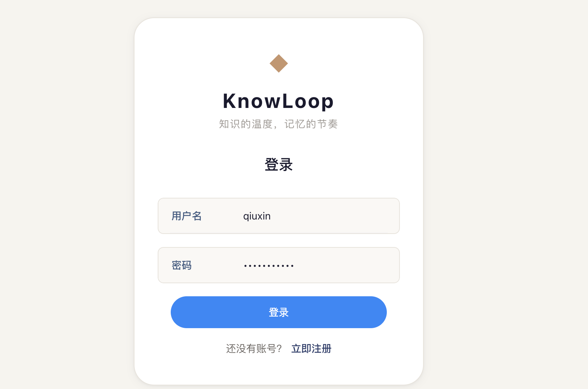
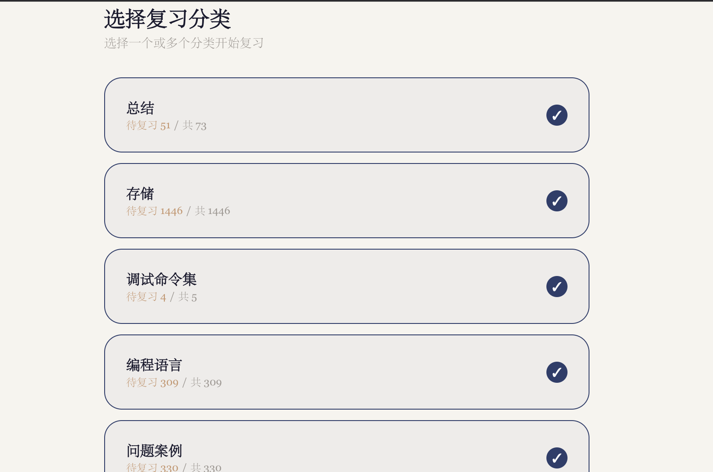
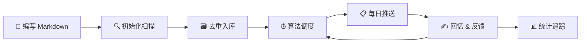

# 🧠 KnowLoop — 基于艾宾浩斯遗忘曲线的智能学习系统

<p align="center">
  
</p>

<p align="center">
  <strong>用科学的方法，让每一份知识都刻进记忆深处。</strong>
</p>

<p align="center">
  
  
  
  
  
  
</p>

---

## ✨ 这是什么？

**KnowLoop** 是一个基于**艾宾浩斯遗忘曲线**的间隔重复学习系统。无论是准备面试、学习新技术还是备考，KnowLoop 都能帮你在最佳时间点复习，用最少的时间实现最牢固的记忆。

> 🎯 **核心原理**：德国心理学家艾宾浩斯发现，人类的遗忘遵循"先快后慢"的规律。在即将遗忘的关键节点进行复习，记忆巩固效果最好。KnowLoop 将这些时间点精确计算出来，自动安排你的复习计划。

<p align="center">
  
</p>

## 🚀 核心亮点

<table>
  <tr>
    <td>📚 <strong>Markdown 即题库</strong></td>
    <td>用最熟悉的 Markdown 格式编写问答，零学习成本。支持多目录、多文件，按主题随心组织。</td>
  </tr>
  <tr>
    <td>🧠 <strong>科学算法驱动</strong></td>
    <td>四级记忆反馈 × 自适应间隔乘数 × 准确率奖励，让算法真正理解你的记忆状态。</td>
  </tr>
  <tr>
    <td>🌐 <strong>双端无缝切换</strong></td>
    <td>CLI 命令行轻量高效，Web 界面美观流畅。同一套数据库，随时随地继续学习。</td>
  </tr>
  <tr>
    <td>👥 <strong>多用户支持</strong></td>
    <td>JWT 认证 + SQLite 数据隔离，家人朋友共用一台服务器，数据互不干扰。</td>
  </tr>
  <tr>
    <td>📊 <strong>可视化统计</strong></td>
    <td>总题数、待复习、正确率一目了然，用数据见证成长。</td>
  </tr>
  <tr>
    <td>🐳 <strong>一键部署</strong></td>
    <td>提供 Docker 镜像和编译脚本，3 分钟从零到运行。</td>
  </tr>
</table>

## 🎬 快速开始

### 准备知识库

创建一个 Markdown 文件，`# q` 标记问题，`# a` 标记答案：

```markdown
# q
什么是闭包？

# a
闭包是指函数能够访问其外部作用域中变量的能力。
在 JavaScript 中，每次函数调用都会创建一个新的闭包。

# q
什么是原型链？

# a
原型链是 JavaScript 实现继承的核心机制。
每个对象都有一个 __proto__ 指向其构造函数的 prototype，
当查找属性时，会沿着这条链逐级向上搜索，直到 Object.prototype。
```

### 启动 Web 版

```bash
# 1. 安装依赖
make deps

# 2. 初始化知识库（首次使用）
make init

# 3. 启动服务
make run-web
```

打开浏览器访问 **http://localhost:4430**，注册账号后即可开始学习。

### 启动 CLI 版

```bash
# 初始化 + 训练
make init && make run-cli

# 查看统计
make stats
```

### Docker 部署

```bash
docker-compose up -d
```

## 🧬 算法揭秘

KnowLoop 的间隔重复算法比传统 SM-2 更细腻：

| 反馈 | 含义 | 基础间隔 | 间隔乘数 |
|------|------|----------|----------|
| 🟢 熟练 | 准确无误地回忆 | 168 小时（7天） | ×2.5 |
| 🔵 一般 | 记得但不流利 | 72 小时（3天） | ×1.8 |
| 🟡 忘记 | 遗忘了部分内容 | 24 小时（1天） | ×1.3 |
| 🔴 完全忘记 | 完全不记得了 | 2 小时 | ×1.0 |

```
next_interval = base_interval × multiplier × accuracy_bonus
                                                      ↑
                                          accuracy > 80% 时额外 ×1.2
```

- 连续 3 次正确 → 记忆等级提升，间隔进一步延长
- 回答错误 → 等级降低，回归高频复习

## 🛠️ 技术栈

| 层 | 技术 | 说明 |
|---|------|------|
| **后端** | Go + Gin + GORM | 高性能 HTTP 服务，RESTful API |
| **前端** | Vue 3 + Vite + Pinia | 现代化 SPA，HMR 极速开发体验 |
| **UI** | Vant 4 | 移动优先的组件库，响应式适配 |
| **数据库** | SQLite | 零配置、嵌入式，数据即文件 |
| **认证** | JWT (HS256) | 无状态鉴权，24h 有效期 |
| **样式** | SCSS + CSS Variables | 设计令牌体系，主题可定制 |

## 📁 项目结构

```
self-improvement/
├── cli_server.go                 # CLI 入口
├── web_server.go                 # Web 服务入口
├── internal/
│   ├── spacedrepetition/         # 🧠 艾宾浩斯算法核心
│   ├── parser/                   # 📄 Markdown 问答解析器
│   ├── models/                   # 🗃️ 数据模型 (User, Question)
│   ├── middleware/               # 🔐 JWT 认证中间件
│   └── server/                   # 🌐 HTTP 路由与 API 处理
├── frontend/                     # Vue 3 前端
│   └── src/
│       ├── views/                # 页面 (Dashboard, Learning, Login)
│       ├── components/           # 组件 (QuestionCard, FeedbackButtons)
│       ├── stores/               # Pinia 状态管理
│       ├── api/                  # Axios 请求封装
│       └── router/               # 路由配置
├── scripts/                      # 构建 & 部署脚本
├── questions/                    # 你的知识库 (.md 文件)
├── data/                         # SQLite 数据库 (自动生成)
└── docs/                         # 文档
```

## 📖 学习工作流



1. **准备阶段** — 用 Markdown 整理你的知识库，按主题分目录
2. **每日训练** — 打开应用，系统自动推送今日该复习的内容
3. **诚实反馈** — 看到问题 → 努力回忆 → 查看答案 → 诚实打分
4. **算法调优** — 根据你的反馈，算法动态调整下一次复习时间
5. **日积月累** — 正确率逐渐提升，知识真正内化为长期记忆

## 🗺️ 路线图

- [ ] 图片题目支持
- [ ] Anki `.apkg` 导入
- [ ] 学习数据可视化图表
- [ ] 微信/钉钉提醒推送
- [ ] PWA 离线支持
- [ ] 多语言国际化
- [ ] 学习笔记与标注

## 🤝 贡献

欢迎提 Issue 和 PR！所有形式的贡献都值得感谢：

1. Fork 本项目
2. 创建特性分支 (`git checkout -b feature/amazing`)
3. 提交你的改动 (`git commit -m 'Add something amazing'`)
4. 推送到分支 (`git push origin feature/amazing`)
5. 发起 Pull Request

## 📄 许可证

MIT License © 2025

---

<p align="center">
  <sub>Made with ❤️ by <a href="https://github.com/lakindufive">lakindufive</a> | 持之以恒，积微成著</sub>
</p>
